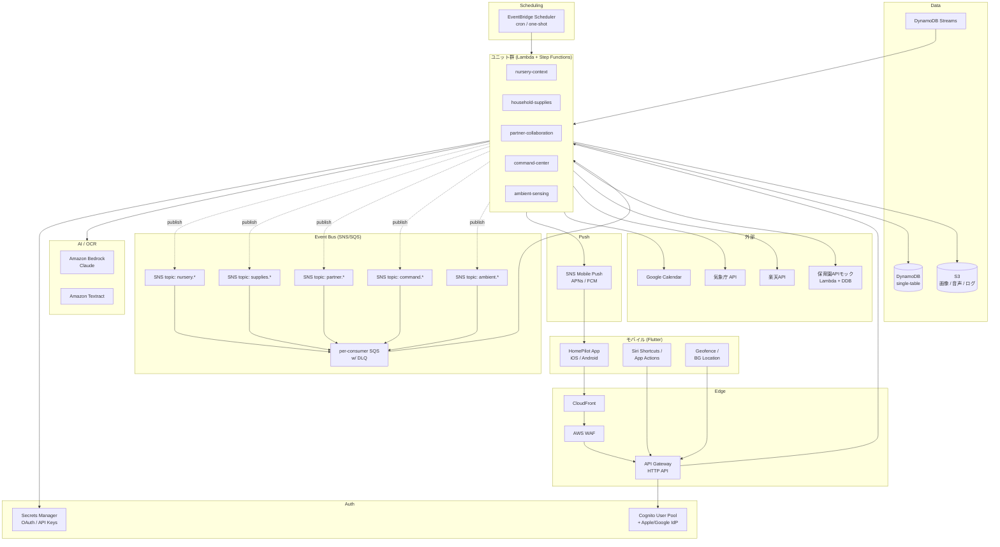
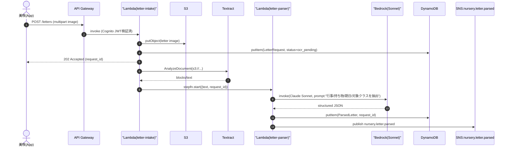
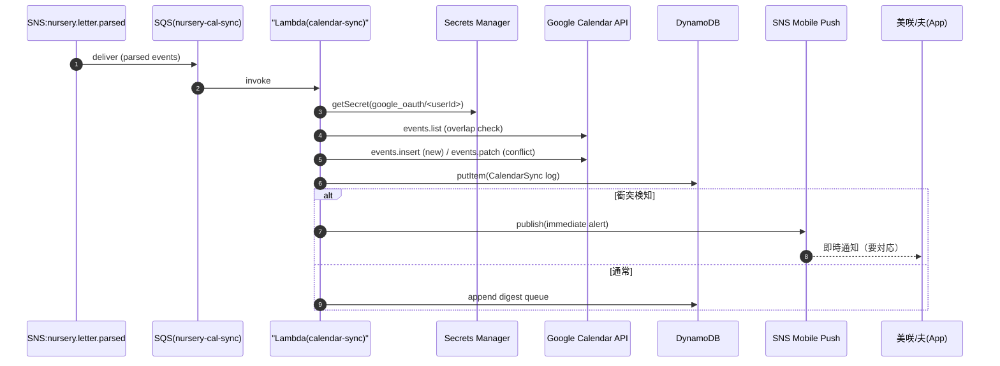
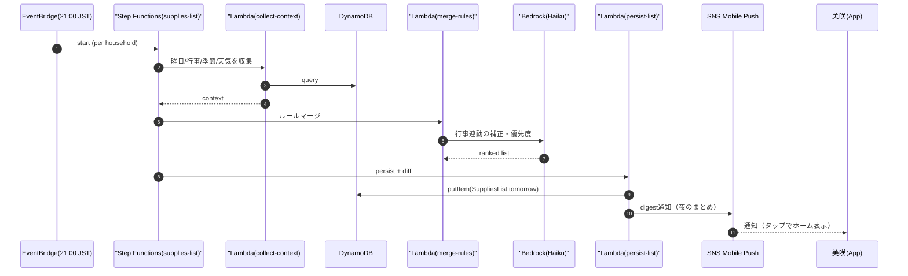
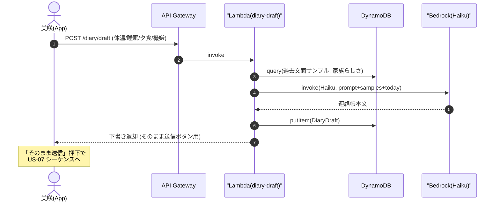
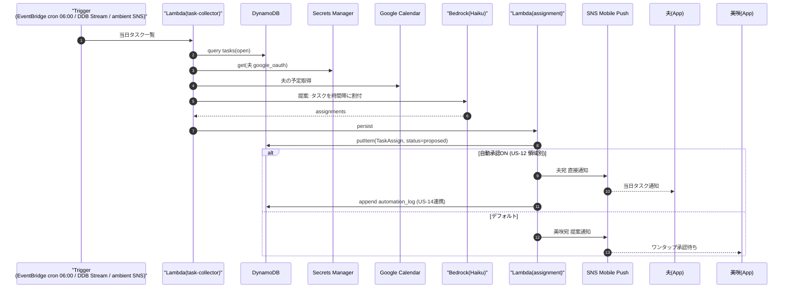
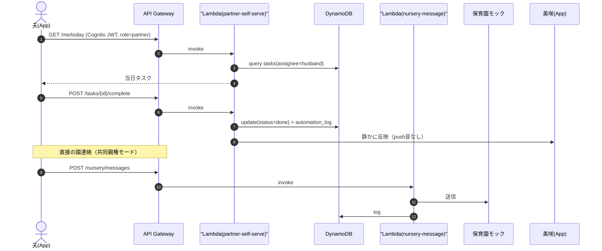
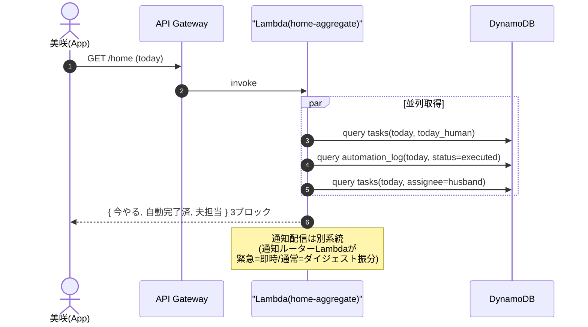
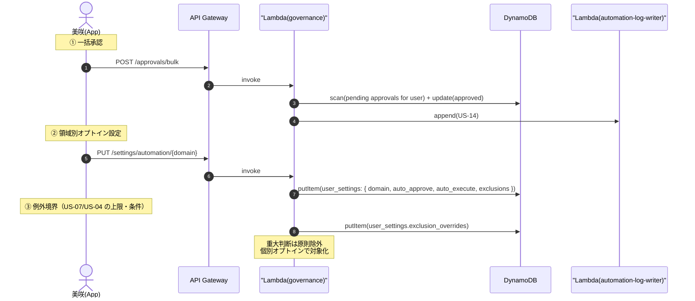

# HomePilot AWS アーキテクチャ設計書

> 入力: [user_stories.md](../user_stories.md) / [units/](../units/)
> ターゲット: プロダクション相当
> リージョン: ap-northeast-1（東京）

---

## 1. アーキテクチャ概要（一文）

Flutter 製モバイルアプリと、Cognito（Apple/Google フェデレーション）認証の上に構築された **フルサーバーレス（API Gateway + Lambda + Step Functions）** バックエンドが、**SNS/SQS によるユニット間イベント連携** と **Bedrock + Textract による AI/OCR 処理** を介して、HomePilot の家庭自動操縦機能を東京リージョン上で提供する。

---

## 2. 設計原則・前提

| 項目 | 決定 |
|---|---|
| ターゲットレベル | プロダクション相当（運用・スケール・観測性込み） |
| モバイル | Flutter（iOS/Android 単一コード） |
| バックエンド | フルサーバーレス（API Gateway + Lambda + Step Functions） |
| 認証 | Cognito User Pool + Federated IdP（Sign in with Apple / Google） |
| AI | Bedrock（Claude）+ Textract（OCR） |
| データ | DynamoDB + S3（必要時に他検討） |
| 通知 | SNS Mobile Push（APNs/FCM） |
| ユニット間連携 | SNS/SQS（pub/sub + 非同期キュー） |
| IaC | AWS CDK (TypeScript) |
| 観測性 | CloudWatch Logs / Metrics（最低限） |
| リージョン | ap-northeast-1 |
| 外部連携 | Google Calendar / 気象庁 / 楽天API / Siri Shortcuts / Google Assistant / 保育園アプリ=モック |

---

## 3. ストーリー横断の要件抽出（ステップ1の成果）

| 区分 | 抽出された要件 | 関連US |
|---|---|---|
| AI/LLM処理 | お便りOCR、連絡帳生成、夫宛トーン整形、音声指示の意図解析 | US-01, US-06, US-10, US-17 |
| 画像取込 | 紙お便りの撮影アップロード | US-01 |
| カレンダー連携 | Google Calendar 双方向同期、衝突検知 | US-02, US-08 |
| EC連携 | 楽天API（在庫推定→自動注文） | US-04 |
| 外部API | 気象庁（天気予報） | US-16 |
| 位置検知 | 端末側ジオフェンス → サーバへイベント送信 | US-16 |
| 音声入力 | OS音声アシスタント（Siri Shortcuts / Google Assistant）→ App Intent → API | US-17 |
| 通知 | 即時/ダイジェストの2系統、APNs/FCM | US-07, US-11, US-15, US-16 |
| 多人数（家族）連携 | 美咲・夫・（保育園モック）。司令塔ロール切替 | US-09, US-15 |
| オプトインガバナンス | 領域別自動承認/自動実行のON/OFF・例外条件 | US-12 |
| 監査・取消 | 全自動実行ログの時系列参照・取消 | US-14 |
| イベント駆動 | ユニット間で「イベント発火→他ユニットが反応」が頻出 | 全般 |

---

## 4. システム全体図



---

## 5. コンポーネント一覧

### 5.1 フロントエンド / Edge
| コンポーネント | 役割 |
|---|---|
| **Flutter App (iOS/Android)** | UI、ロック画面ウィジェット、ジオフェンス、Siri Shortcuts / App Actions、APNs/FCM 受信 |
| **CloudFront** | HTTPS終端、静的アセット配信、APIキャッシュ（適用箇所限定） |
| **AWS WAF** | レート制限、Bot 対策、SQLi/XSS 等の保護 |
| **API Gateway (HTTP API)** | 統一APIエンドポイント、Cognito JWT 検証 |

### 5.2 認証
| コンポーネント | 役割 |
|---|---|
| **Cognito User Pool** | ユーザー管理、JWT発行、Hosted UI（必要に応じ） |
| **Cognito Federated IdP** | Sign in with Apple / Google を IdP として連携 |
| **Secrets Manager** | Google Calendar OAuth トークン、楽天API キー、Apple/Google client secret 等 |

### 5.3 コンピュート
| コンポーネント | 役割 |
|---|---|
| **AWS Lambda (Node.js 20)** | 各ユニットのビジネスロジック、API ハンドラ、イベント処理 |
| **AWS Step Functions** | 複数アクションのファンアウト・補償処理（US-17 音声ワンショット、US-04 期日逆算） |
| **EventBridge Scheduler** | cron（毎晩の持ち物リスト生成、毎朝の天気コンテキスト評価、ダイジェスト配信） |
| **Amazon SNS / SQS** | ユニット間 pub/sub と非同期キュー（DLQ 付き） |

### 5.4 AI / OCR
| コンポーネント | 役割 |
|---|---|
| **Amazon Bedrock (Claude Haiku)** | 連絡帳生成、トーン整形、音声指示の意図解析、軽量分類 |
| **Amazon Bedrock (Claude Sonnet)** | お便り構造化（Textract出力の意味抽出）、複雑な調整提案 |
| **Amazon Textract** | お便り画像のOCR（行事・持ち物・期日抽出のテキスト化） |

### 5.5 データ
| コンポーネント | 役割 |
|---|---|
| **DynamoDB (single-table)** | 主データストア。全ユニットの状態・イベント・ユーザー設定を1テーブルに集約 |
| **DynamoDB Streams** | 変更イベントの後段Lambda起動（CDC） |
| **Amazon S3** | お便り画像、音声録音、添付、長期ログ保管 |

### 5.6 通知
| コンポーネント | 役割 |
|---|---|
| **SNS Mobile Push** | APNs（iOS）/ FCM（Android）に対するプッシュ配信。即時 vs ダイジェストはルーター Lambda で振り分け |

### 5.7 観測性 / セキュリティ
| コンポーネント | 役割 |
|---|---|
| **CloudWatch Logs / Metrics** | 全 Lambda・API GW・SQS の標準ログ／メトリクス、基本アラーム |
| **IAM** | Lambda ごと最小権限、Cognito 認可ロール |
| **KMS** | DynamoDB / S3 / Secrets Manager のCMK暗号化 |

---

## 6. ユニット別の AWS マッピング

各ユニットは **「Lambda関数群 + 専用 SNS topic + SQS subscription + DynamoDB のパーティション群」** の組合せで構成し、独立デプロイ可能。

### 6.1 nursery-context（保育園との双方向I/O）
| 役割 | 利用サービス |
|---|---|
| お便り画像受領（US-01） | API GW → Lambda → S3（put）→ Textract → Lambda → Bedrock Sonnet → DDB（解析結果保存）→ SNS publish `nursery.letter.parsed` |
| カレンダー反映（US-02） | Lambda（SQS consumer）→ Google Calendar API（OAuth via Secrets Manager） |
| 連絡帳下書き（US-06） | API GW → Lambda → Bedrock Haiku → DDB（下書き保存）→ APP に返却 |
| 欠席連絡代行（US-07） | 起動経路は2系統: ① 美咲が手動操作: API GW → Lambda / ② 自動トリガ: 体温入力（US-06）→ DDB → DDB Streams →（37.5℃以上検知）→ Step Functions。いずれも → 保育園APIモック |
| 公開イベント | `nursery.letter.parsed` / `nursery.event.added` / `nursery.message.sent` |

### 6.2 household-supplies（持ち物・物資）
| 役割 | 利用サービス |
|---|---|
| 翌晩の持ち物リスト生成（US-03） | EventBridge Scheduler（毎晩 21:00 JST）→ Step Functions → DDB読み・Bedrock Haiku（行事連動の整理）→ DDB保存 → SNS Push |
| 期日逆算自動準備（US-04） | DDB Stream（行事追加検知）+ EventBridge（在庫予測）→ Step Functions → 楽天API → DDB |
| 公開イベント | `supplies.list.generated` / `supplies.order.placed` / `supplies.shortage.detected` |

### 6.3 partner-collaboration（夫婦協働）
| 役割 | 利用サービス |
|---|---|
| タスク自動アサイン（US-08） | 起動: ① 朝 06:00 JST EventBridge cron（当日タスク再評価）／② 新規 Task 作成イベント（DDB Stream → SQS）／③ ambient-sensing 由来イベント（位置・音声）。いずれも → Lambda → Google Calendar 取得（夫予定）→ Bedrock Haiku（割付提案）→ DDB / SNS Push |
| 夫の自走化UI（US-09） | API GW → Lambda → DDB（夫スコープ） |
| トーン緩衝（US-10） | API GW → Lambda → Bedrock Haiku → DDB |
| 司令塔バトンタッチ（US-15） | API GW → Lambda → DDB（commander フィールド更新） |
| 公開イベント | `partner.task.assigned` / `partner.task.completed` / `partner.commander.changed` |

### 6.4 command-center（司令塔体験）
| 役割 | 利用サービス |
|---|---|
| 「今日これだけ」ホーム（US-11） | API GW → Lambda → DDB（複数ユニットのスナップショット集約）。即時/ダイジェスト振り分けは通知ルーターLambdaで判定 |
| 一括承認＆オプトイン制御（US-12） | API GW → Lambda → DDB（user_settings, approvals）。除外条件・例外（US-07/US-04）も DDB で参照 |
| 事後報告ログ（US-14） | DDB（automation_log）。Stream で集約用 GSI 更新 |
| 通知ルーターLambda | 各ユニットの SNS topic を購読し、緊急/ルーチンを判別して SNS Mobile Push に振り分け |
| 公開イベント | `command.approved` / `command.automation.executed` |

### 6.5 ambient-sensing（環境信号トリガ）
| 役割 | 利用サービス |
|---|---|
| 位置トリガ（US-16） | アプリのジオフェンス（Flutter）→ API GW → Lambda → 該当下流ユニットへ SNS publish |
| 天気トリガ（US-16） | EventBridge Scheduler（毎日 19:00 / 06:30 JST）→ Lambda → 気象庁API → DDB → 必要に応じ household-supplies / command-center を発火 |
| 音声ワンショット（US-17） | App Intent → API GW → Lambda（Bedrock Haiku で意図解析）→ Step Functions（並列実行: nursery欠席連絡 / partner通知 / supplies自動補充 / カレンダー再調整）→ command-center に集約報告 |
| 公開イベント | `ambient.location.entered` / `ambient.weather.alert` / `ambient.voice.intent` |

---

## 7. ユーザーストーリー × コンポーネント 対応マトリクス

| US | 主担当ユニット | 主要 AWS サービス | 外部連携 |
|---|---|---|---|
| US-01 | nursery-context | API GW, Lambda, S3, Textract, Bedrock Sonnet, DDB, SNS | - |
| US-02 | nursery-context | Lambda(SQS), DDB, Secrets Manager | Google Calendar |
| US-03 | household-supplies | EventBridge Scheduler, Step Functions, Lambda, Bedrock Haiku, DDB, SNS Mobile Push | - |
| US-04 | household-supplies | DDB Streams, EventBridge, Step Functions, Lambda, Secrets Manager | 楽天API |
| US-06 | nursery-context | API GW, Lambda, Bedrock Haiku, DDB | - |
| US-07 | nursery-context | API GW, Step Functions, Lambda, DDB | 保育園APIモック |
| US-08 | partner-collaboration | Lambda, Bedrock Haiku, DDB, SNS, Secrets Manager | Google Calendar |
| US-09 | partner-collaboration | API GW, Lambda, DDB（夫スコープ） | 保育園APIモック |
| US-10 | partner-collaboration | API GW, Lambda, Bedrock Haiku, DDB | - |
| US-11 | command-center | API GW, Lambda, DDB | - |
| US-12 | command-center | API GW, Lambda, DDB | - |
| US-14 | command-center | Lambda, DDB, DDB Streams | - |
| US-15 | partner-collaboration | API GW, Lambda, DDB | - |
| US-16 | ambient-sensing | API GW, EventBridge Scheduler, Lambda, DDB, SNS | 気象庁API |
| US-17 | ambient-sensing | API GW (App Intents), Lambda, Bedrock Haiku, Step Functions, SNS, DDB | - |

---

## 8. 主要シーケンス（Must優先度の8ストーリー）

### 8.1 US-01: お便り自動解釈



### 8.2 US-02: 行事・予定の自動カレンダー反映



### 8.3 US-03: 明日の持ち物リスト自動生成



### 8.4 US-06: 連絡帳の自動下書き



### 8.5 US-08: タスクの夫への自動アサイン



### 8.6 US-09: 夫の自走化UI



### 8.7 US-11: 「今日これだけ」ホーム画面



### 8.8 US-12: 一括承認＆領域別オプトイン自動実行制御



---

## 9. データモデル概要（DynamoDB Single-Table）

### 9.1 設計方針
- **1テーブル、PK = `HOUSEHOLD#<id>`、SK で型を分離**（家族単位のクエリ最適化）
- ストリームを有効化し、CDC でユニット間連携を補助
- 横断クエリ用に GSI を最小限（`gsi1: assignee × dueDate`、`gsi2: type × executedAt`）

### 9.2 主要エンティティ（SK プレフィックス例）
| エンティティ | SK プレフィックス | 用途 |
|---|---|---|
| Household | `META#` | 世帯メタ |
| User | `USER#<sub>` | Cognito subとの紐付け、ロール（mom/dad/commander） |
| Letter | `LETTER#<id>` | お便り画像メタ＋OCR結果 |
| ParsedEvent | `EVENT#<id>` | 抽出予定（カレンダー同期前） |
| CalendarSync | `CALSYNC#<id>` | Google Calendar 同期ログ |
| Diary | `DIARY#<date>` | 連絡帳下書き／送信履歴 |
| NurseryMessage | `NURMSG#<id>` | 欠席・遅刻連絡履歴（モック宛） |
| Task | `TASK#<id>` | 家事・育児タスク |
| TaskAssign | `ASSIGN#<id>` | アサイン提案／結果 |
| SuppliesList | `SUPLIST#<date>` | 翌日の持ち物リスト |
| InventoryItem | `INV#<sku>` | 消耗品在庫推定 |
| Approval | `APP#<id>` | 承認待ち提案 |
| AutomationLog | `LOG#<ts>#<id>` | US-14 監査ログ |
| UserSettings | `SET#` | 領域別オプトインON/OFF・例外 |
| AmbientEvent | `AMB#<ts>#<id>` | 位置・天気・音声トリガ |

---

## 10. 横断要素

### 10.1 認証・認可
- **Cognito User Pool**（Hosted UI 不使用、Flutter から OAuth flow）
- IdP: Sign in with Apple、Sign in with Google を Federation で連携
- API Gateway は Cognito JWT Authorizer
- Lambda 内で `cognito:groups` または DDB の User.role（mom/dad/commander）で機能ゲート
- 司令塔バトンタッチ（US-15）は DDB の `Household.commander` を切替し、各 Lambda が読み込んで挙動変更

### 10.2 通知ルーティング（即時 vs ダイジェスト）
- 各ユニットは SNS topic に `priority: immediate | digest` 属性付きで publish
- **通知ルーター Lambda**（command-center 配下）が SQS で全 topic を購読
  - `immediate`（US-07 発熱連絡 / US-16 お迎え引継ぎ 等）→ 即時 SNS Mobile Push
  - `digest` → DDB の `DigestQueue` に積み、EventBridge（朝/昼/夜）でまとめて配信
- 司令塔バトンタッチ中は宛先 token を夫端末側に切替

### 10.3 観測性（最低限）
- Lambda は Powertools for Lambda（TypeScript）で structured log
- CloudWatch Logs：14日保管、長期は S3 へエクスポート
- CloudWatch Metrics：Lambda invocations / errors、API GW 4xx/5xx、SQS DLQ depth、Bedrock invocation 回数
- アラーム：DLQ > 0 / API GW 5xx 率 / Bedrock スロットリング

### 10.4 セキュリティ
- IAM: Lambda ごと最小権限
- KMS-CMK: DynamoDB / S3 / Secrets Manager
- WAF: API GW にレート制限 + マネージドルール
- Secrets Manager: Google OAuth refresh token、楽天API key、Apple/Google client secret
- VPC: Lambda はデフォルトで VPC 外（外部 API への低レイテンシ）。VPC が必要な拡張時に追加

### 10.5 マルチテナント / 個人情報
- すべての DDB/S3 アクセスは `HOUSEHOLD#<id>` のスコープを Lambda 側で強制
- 子の体温・体調はセンシティブデータとして S3 保管時に CMK 暗号化＋アクセスログ
- Bedrock 推論は東京リージョンの提供モデル（Claude Haiku / Sonnet）を利用

---

## 11. IaC / CDK 構成（TypeScript）

```
infra/
├── bin/homepilot.ts                # エントリポイント
├── lib/
│   ├── stacks/
│   │   ├── core-stack.ts           # VPCなし、共通: Cognito, KMS, Secrets, S3, DDB
│   │   ├── api-stack.ts            # CloudFront, WAF, API Gateway, JWT Authorizer
│   │   ├── unit-nursery-stack.ts   # nursery-context Lambda群 + topic + SQS
│   │   ├── unit-supplies-stack.ts
│   │   ├── unit-partner-stack.ts
│   │   ├── unit-command-stack.ts
│   │   ├── unit-ambient-stack.ts
│   │   ├── ai-stack.ts             # Bedrock invoke role / Textract role
│   │   ├── push-stack.ts           # SNS Platform Apps (APNs/FCM)
│   │   └── observability-stack.ts  # alarms, dashboards
│   └── constructs/
│       ├── unit.ts                 # 共通: Lambda + topic + SQS パターン
│       └── api-route.ts            # 共通: APIGW route → Lambda
```

---

## 12. コスト概算（オーダー）

### 12.1 想定ワークロード
- 100 世帯（200 アクティブユーザー）程度の MVP〜小規模本番想定
- 1ユーザーあたり 平均 50 API リクエスト/日、お便りOCR 月 30 ページ、音声ワンショット 月 20 回 程度

### 12.2 月額試算（USD、東京リージョン目安）

| サービス | 想定量 | 概算 |
|---|---|---|
| API Gateway (HTTP) | 0.3M req | ≒ $0.30 |
| Lambda | 0.5M invocations × 200ms × 256MB | ≒ $2 |
| Step Functions | 10K state transitions | ≒ $0.25 |
| EventBridge Scheduler | < 100K events | ≒ $1 |
| **Bedrock Claude Haiku** | ~50K invokes / 40M tokens 計 | ≒ $40〜60 |
| **Bedrock Claude Sonnet** | ~10K invokes / 20M tokens 計 | ≒ $80〜120 |
| Textract | 3K pages | ≒ $4.5 |
| DynamoDB (on-demand) | 0.5M R / 0.3M W + 5GB | ≒ $1 |
| S3 | 10GB + 100K req | ≒ $0.5 |
| SNS Mobile Push | 50K notifications | ≒ $0.05 |
| SQS | 200K msgs | ≒ $0.10 |
| Secrets Manager | 5 secrets | ≒ $2 |
| Cognito User Pool (federation) | 200 MAU（無料枠 50K MAU 内） | ≒ $0 |
| CloudWatch Logs / Metrics | 5GB ingest | ≒ $3 |
| WAF + CloudFront | 通常域 | ≒ $5〜10 |
| **合計（小規模本番）** |  | **≒ $140〜210 / 月** |

### 12.3 スケール時の主コストドライバ
1. **Bedrock 推論**（ユーザー数と利用頻度に比例、Sonnet 使用率を下げると効果大）
2. **Textract**（OCR ページ数）
3. **CloudWatch Logs**（保管期間と詳細度）

---

## 13. 非機能トレードオフと選定理由

| トレードオフ | 採用 | 理由 |
|---|---|---|
| サーバーレス vs コンテナ | サーバーレス | スパイキーな家庭イベント駆動。コールドスタートはユーザー体感1秒以内に収まる範囲。スケールはAWS任せ |
| 単一テーブル vs 複数テーブル DDB | 単一テーブル | 家族（HOUSEHOLD）単位で関連エンティティをまとめて読みたい用途が多く、横断JOINが原則不要 |
| Bedrock vs SageMaker | Bedrock | OCR→意味抽出は基盤モデルで十分。運用負担を最小化 |
| Textract vs Bedrock マルチモーダル | Textract（+ Bedrock） | 帳票・お便りのOCR精度と費用効率で Textract が優位。意味抽出は Bedrock |
| ユニット間 同期 API vs SNS/SQS | SNS/SQS | 1イベントから複数ユニットが反応するファンアウトが頻出。疎結合・リトライ・DLQ で堅牢 |
| Cognito フェデレーション vs 自前 JWT検証 | Cognito | Apple/Google IdP のトークン管理・属性マッピングを標準で吸収。MAU 50K まで無料 |
| Flutter vs Native | Flutter | iOS/Android 同時提供、ロック画面ウィジェット・App Intents もプラグインで対応可。学習コスト均一 |
| 観測性 最低限 vs フル | 最低限 | 初期コスト圧縮。本番拡張時に X-Ray / Logs Insights / カスタムダッシュボードを追加可能 |
| 東京 vs マルチリージョン | 東京 | データ所在地・レイテンシ・関係者全員が東京。Bedrock も東京で Claude Haiku/Sonnet を提供 |

---

## 付録A: ストーリー → イベントトピック対応

| イベント | publisher | subscriber |
|---|---|---|
| `nursery.letter.parsed` | nursery-context | household-supplies（行事アイテム検出）, command-center（ホーム反映） |
| `nursery.event.added` | nursery-context | command-center, partner-collaboration（タスク化候補） |
| `supplies.list.generated` | household-supplies | command-center |
| `supplies.shortage.detected` | household-supplies | command-center, ambient-sensing（音声ワンショット連動候補） |
| `supplies.order.placed` | household-supplies | command-center（automation_log） |
| `partner.task.assigned` | partner-collaboration | command-center |
| `partner.task.completed` | partner-collaboration | command-center |
| `partner.commander.changed` | partner-collaboration | 全ユニット（宛先切替） |
| `ambient.location.entered` | ambient-sensing | partner-collaboration（お迎え引継ぎ）, nursery-context（登園済） |
| `ambient.weather.alert` | ambient-sensing | household-supplies（持ち物追加） |
| `ambient.voice.intent` | ambient-sensing | nursery-context, partner-collaboration, household-supplies, command-center |
| `command.approved` | command-center | （履歴のみ） |
| `command.automation.executed` | command-center | （集約・US-14） |
